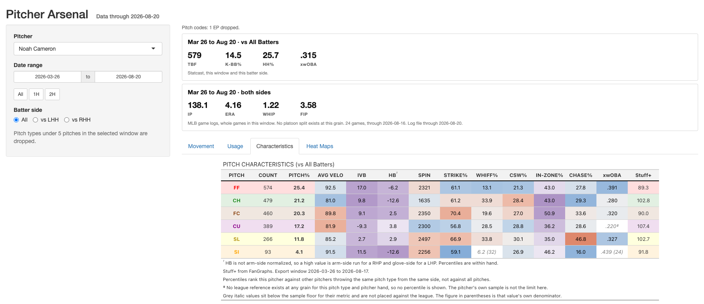
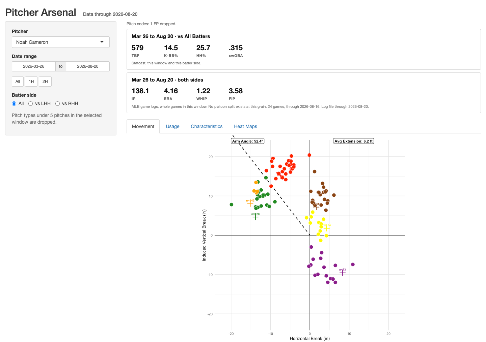

# Pitcher Arsenal

A Shiny app that replaces a manual, pitcher-by-pitcher advance scouting
workflow. Pick a pitcher, a date range and a batter side, and the app returns
movement, usage, pitch characteristics, count usage and heat maps, each one
placed against a league reference for the same pitch type and the same pitcher
hand.

It reads two precomputed files at startup and renders. It never pulls from
Baseball Savant while a user is on the page, and it needs no credentials.



The Movement tab, same selection:



## Run it

```bash
git clone <this repo> && cd statcast-arsenal-app
Rscript -e 'renv::restore()'
Rscript -e 'shiny::runApp(".", launch.browser = TRUE)'
```

`renv.lock` pins 83 packages against R 4.5.2, so the environment reproduces
without hunting versions.

The three files under `data/` are gitignored, since they are rebuildable and run
to 25 MB. Build them with the daily chain:

```bash
Rscript scripts/update_data.R
```

Step 1 of that chain updates a season store rather than creating one, so on a
machine that has never held one, point `STATCAST_STORE` at an existing
`statcast_clean_2026.rds` or build one first with a one-time full-season pull
through `pull_season_statcast()`. Everything after step 1 is a pure transform of
that store.

## The daily chain

`scripts/update_data.R` is the only thing that writes data. Four steps: update
the season store from Savant, rebuild `league_ref.rds`, pull `game_logs.rds`
from the MLB StatsAPI, and write the trimmed `app_data.rds` the app reads.

It runs at 06:15 daily under launchd. `scripts/chain_status.sh` reports last
night's outcome, and separates a failed run from a stale success left by a job
that never fired.

Current artifacts: 563,401 pitches across 814 pitchers, 2026-03-26 through
2026-08-20, in 27 columns and 22.5 MB.

## Methodology

**League context is built pitcher-first.** Every reference value is the mean of
a per-pitcher distribution, never a pool of pitches across the league. Pooling
pitches lets one 3,000-pitch starter outvote thirty relievers, which is a
different question from the one the table asks. `league_ref.rds` stores that
distribution's quantiles at one-point increments for each pitch type crossed
with pitcher hand, batter side and count bucket, 4,120 cells in all, so a
percentile lookup at runtime is a `findInterval()` and costs nothing. Pitcher
hand is never dropped from the grain: horizontal break is not arm-side
normalized, so a righty's and a lefty's sliders sit on opposite sides of zero
and their pooled mean lands where neither hand throws.

**Sample floors are stated on the page, not smoothed over.** A metric below its
floor renders grey and italic with its own denominator in parentheses, rather
than being coloured against a league it cannot honestly be compared to. Pitch
types under five pitches in the window are dropped, heat map panels under
fifteen fall back to plotting raw locations as white dots instead of a density
surface, and a reference cell built on fewer than twenty pitchers is not used at
all: the lookup steps down a fallback ladder to a coarser grain, and the table
marks every cell that took that step. The reconciler that maps Savant's pitch codes onto the eleven the app
charts reports what it did above the tabs, so "39 CS remapped to CU" is visible
rather than silent.

**Rate stats and counting stats come from different sources on purpose.** The
Statcast half of the results panel follows the batter side selector. The ERA,
WHIP and FIP half does not, because it comes from MLB game logs and a game log
has no platoon split: a vs-RHH ERA does not exist rather than being merely
unavailable. Innings pitched cannot be derived from pitch-level data at all,
since `events` carries one row per plate appearance and a double play reads as
one out, so IP comes from the game logs and is stored as outs everywhere.
StatsAPI writes it in thirds, where "5.2" means five innings and two outs, and
one parser handles that for both the chain and the app. FIP's constant is
derived from the same log file the panel's FIPs are computed against rather than
quoted from memory: on 2026 it lands at 3.088, not the 3.10 that gets repeated.

## What the table does not claim

Percentiles rank a pitch against its own pitch type, which is narrower than the
diverging colour scale suggests. A 35th-percentile sinker whiff rate and a
35th-percentile slider whiff rate render identically and do not mean the same
thing, because sinkers miss few bats by design. The source note says percentiles
rank within pitch type and hand, which stops the table implying a cross-pitch
ranking, but it does not solve the reading.

Stuff+ comes from a dated FanGraphs export, and the export window is printed in
the table's source note so a stale one is visible on the page. Where FanGraphs
and Savant disagree on a pitch code, the mapping is footnoted rather than
applied silently.

## Layout

```
app.R           ui and server, thin. Logic lives in R/.
R/              theme, data, features, plots, tables, league, stuff, results
scripts/        the daily chain, the league reference build, the regression check
tests/          six suites, all of which must pass before anything ships
fg_stuff/       dated FanGraphs Stuff+ exports
data/           the three rds artifacts, gitignored and rebuildable
```
